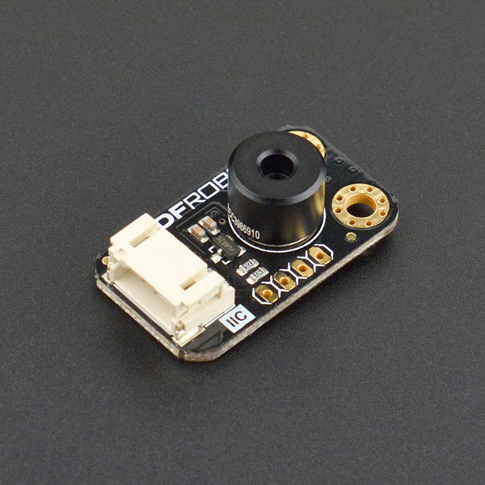

# DFRobot_MLX90614
* [English Version](./README.md)

这是一个针对MLX90614的库，功能是读取温度。
MLX90614是一款用于非接触式温度测量的红外温度计。
红外敏感热电堆探测器芯片和信号调理ASSP集成在同一个TO-39 can中。
由于其低噪声放大器，17位ADC和强大的DSP单元，实现了高精度和分辨率的温度计。
该设备采用I2C通信，基于SMBus协议。




## 产品链接 (https://www.dfrobot.com.cn/search.php?keywords=mlx90614)
    SKU：SEN0206/SEN0263


## 目录

* [概述](#概述)
* [库安装](#库安装)
* [方法](#方法)
* [兼容性](#兼容性)
* [历史](#历史)
* [创作者](#创作者)


## 概述

* MLX90614可读取温度。
* 库支持I2C通信。
* MLX90614是Melexis提供的一款可随时使用的低成本非接触式温度计，输出数据线性依赖于物体温度，具有高精度和扩展分辨率。
* MLX90614-xCx的高热稳定性使其非常适合于二次热源加热传感器的应用。与其他类型的热电堆传感器相比，这些传感器的稳定时间非常短，这对于在环境温度可以快速变化的条件下需要精确测量的人来说是非常重要的。
* MLX90614支持广泛的定制温度，电源和刷新率。
* 用户可以为低发射率的物体编写内部目标发射率校正程序。内置错误检查和纠错机制，提供高可靠性的内存。
* 传感器安装在行业标准的TO39封装中，适用于单区和双区红外温度计。该温度计可在汽车等级和可以使用两种不同的包装更广泛的应用范围。
* 运行期间的低功耗和睡眠模式下的低电流消耗使温度计非常适合手持移动应用程序。
* 数字传感器接口可以是一个功率和测量PWM或一个增强的访问SMBus兼容协议。只需两条信号线，就可以建立拥有100多个设备的系统。双区非接触式温度测量可通过单线(扩展PWM)。
* 内置的热继电器功能进一步扩展了各种冷冻/沸腾预防和警报系统的容易实现，以及恒温器(不需要MCU)。


## 库安装

要使用这个库，首先下载库文件，将其粘贴到\Arduino\libraries目录中，然后打开示例文件夹并在文件夹中运行演示。


## 方法

```C++

  /**
   * @fn begin
   * @brief 初始化函数
   * @return int类型, 表示返回初始化的状态
   * @retval 0 NO_ERROR
   * @retval -1 ERR_DATA_BUS
   * @retval -2 ERR_IC_VERSION
   */
  virtual int begin(void);

  /**
   * @fn setEmissivityCorrectionCoefficient
   * @brief 设置发射率校准系数, 需要用户手动计算“传感器更改发射率之前测量的温度”与“物体真实温度”的比值, 
   * @n     将这个作为参数传入此api, 之后传感器测量对应物体的绝对温度值的偏差就会降低
   * @param calibrationValue 新的校准系数值, “传感器更改发射率之前测量的温度”与“物体真实温度”的比值, 范围: (0~1)
   * @return None
   */
  void setEmissivityCorrectionCoefficient(float calibrationValue);

  /**
   * @fn setMeasuredParameters
   * @brief 设置测量参数, 包括IIR（无限长度脉冲响应数字滤波器）、FIR（有限长度脉冲响应数字滤波器）
   * @details 过滤噪声(有偏差的测量数据), 提供数据精度, 可设置滤波系数如下
   * @param IIRMode: eIIR100, eIIR80, eIIR67, eIIR57;
   * @param FIRMode: eFIR128, eFIR256, eFIR512, eFIR1024;
   * @return None
   */
  void setMeasuredParameters(eIIRMode_t IIRMode=eIIR100, eFIRMode_t FIRMode=eFIR1024);

  /**
   * @fn getAmbientTempCelsius
   * @brief 获取环境温度, 单位摄氏度
   * @return 返回值范围为： -40.01 °C ~ 85 °C
   */
  float getAmbientTempCelsius(void);

  /**
   * @fn getObjectTempCelsius
   * @brief 获取测量物体的温度, 单位摄氏度
   * @return 返回值范围为： 
   * @n  -70.01 °C ~ 270 °C(MLX90614ESF-DCI)
   * @n  -70.01 °C ~ 380 °C(MLX90614ESF-DCC)
   */
  float getObjectTempCelsius(void);

  /**
   * @fn enterSleepMode
   * @brief 控制传感器睡眠模式, 配置了传感器之后必须进出一次睡眠模式（相当于软复位）, 才能保证之后测量数据读取正常
   * @param mode 选择进入睡眠模式还是退出睡眠模式, 默认为进入睡眠模式
   * @n            true 使传感器睡眠
   * @n            false 唤醒传感器（掉电重启后会自动退出睡眠模式）
   * @return None
  */
  void enterSleepMode(bool mode=true);

  /**
   * @fn setI2CAddress
   * @brief 设置I2C通信地址, 掉电重启后生效
   * @param addr 新的I2C通信地址 7bit, 范围: (0~127)
   * @return None
   */
  void setI2CAddress(uint8_t addr);

```


## 兼容性

MCU                | Work Well    | Work Wrong   | Untested    | Remarks
------------------ | :----------: | :----------: | :---------: | -----
Arduino Uno        |      √       |              |             | 
Firebeetle ESP8266 |      √       |              |             | 
Firebeetle ESP32-E |      √       |              |             | 
FireBeetle M0      |      √       |              |             | 
micro:bit          |      √       |              |             | 


## History

- 2021/08/09 - 1.0.0 版本
- 2022/07/04 - 1.0.1 版本


## Credits

Written by qsjhyy(yihuan.huang@dfrobot.com), 2021. (Welcome to our [website](https://www.dfrobot.com/))

