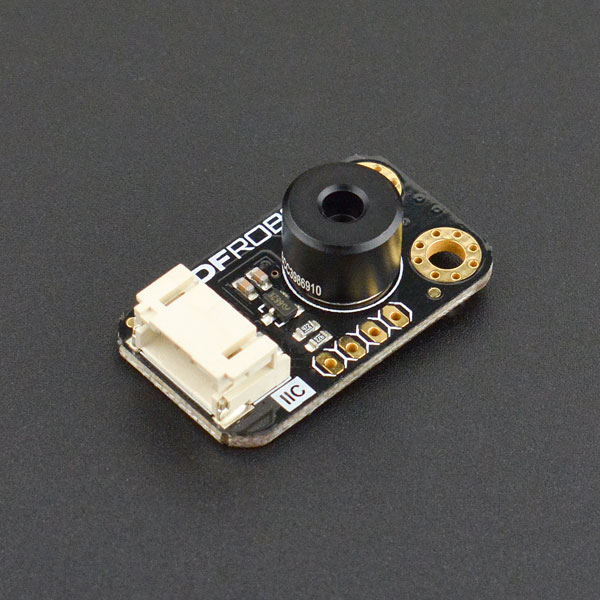

# DFRobot_BME68x

* [English Version](./README.md)

这是一个针对MLX90614的库，功能是读取温度。
MLX90614是一款用于非接触式温度测量的红外温度计。
红外敏感热电堆探测器芯片和信号调理ASSP集成在同一个TO-39 can中。
由于其低噪声放大器，17位ADC和强大的DSP单元，实现了高精度和分辨率的温度计。
该设备采用I2C通信，基于SMBus协议。

 

## 产品链接(https://www.dfrobot.com.cn/goods-1302.html)
    SKU: SEN0206

## 目录

  * [概述](#概述)
  * [库安装](#库安装)
  * [方法](#方法)
  * [兼容性](#兼容性)
  * [历史](#历史)
  * [创作者](#创作者)

## 概述
* MLX90614可读取温度。
* 库支持I2C通信。
* MLX90614是Melexis提供的一款可随时使用的低成本非接触式温度计，输出数据线性依赖于物体温度，具有高精度和扩展分辨率。
* MLX90614-xCx的高热稳定性使其非常适合于二次热源加热传感器的应用。与其他类型的热电堆传感器相比，这些传感器的稳定时间非常短，这对于在环境温度可以快速变化的条件下需要精确测量的人来说是非常重要的。
* MLX90614支持广泛的定制温度，电源和刷新率。
* 用户可以为低发射率的物体编写内部目标发射率校正程序。内置错误检查和纠错机制，提供高可靠性的内存。
* 传感器安装在行业标准的TO39封装中，适用于单区和双区红外温度计。该温度计可在汽车等级和可以使用两种不同的包装更广泛的应用范围。
* 运行期间的低功耗和睡眠模式下的低电流消耗使温度计非常适合手持移动应用程序。
* 数字传感器接口可以是一个功率和测量PWM或一个增强的访问SMBus兼容协议。只需两条信号线，就可以建立拥有100多个设备的系统。双区非接触式温度测量可通过单线(扩展PWM)。
* 内置的热继电器功能进一步扩展了各种冷冻/沸腾预防和警报系统的容易实现，以及恒温器(不需要MCU)。

## 库安装
1. 下载库至树莓派，要使用这个库，首先要将库下载到Raspberry Pi，命令下载方法如下:<br>
```python
sudo git clone https://github.com/DFRobot/DFRobot_MLX90614
```
2. 打开并运行例程，要执行一个例程demo_x.py，请在命令行中输入python demo_x.py。例如，要执行 example.py例程，你需要输入:<br>

```python
cd example
python example.py 
```

## 方法

```python
    '''!
      @brief 初始化传感器
      @param address  mlx90614从机地址
    '''
    def __init__(self, address=0x5a, bus_num=1):
    
    '''!
      @brief 将寄存器原始数值转化为温度
      @param data 寄存器原始数值
    '''
    def data_to_temp(self, data)
    
    '''!
      @brief 获取测量环境温度
      @param none
    '''
    def get_amb_temp(self)
    
    '''!
      @brief 获取测量物体温度
      @param none
    '''
    def get_obj_temp(self):
```

## 兼容性

| 主板         | 通过 | 未通过 | 未测试 | 备注 |
| ------------ | :--: | :----: | :----: | :--: |
| RaspberryPi2 |      |        |   √    |      |
| RaspberryPi3 |   √    |        |      |      |
| RaspberryPi4 |  √   |        |        |      |

* Python 版本

| Python  | 通过 | 未通过 | 未测试 | 备注 |
| ------- | :--: | :----: | :----: | ---- |
| Python2 |     |        |    √    |      |
| Python3 |   √   |        |       |      |

## 历史

- 2024/07/15 - 1.0.0 版本

## 创作者

Written by [YeezB](roger961130@icloud.com), 


